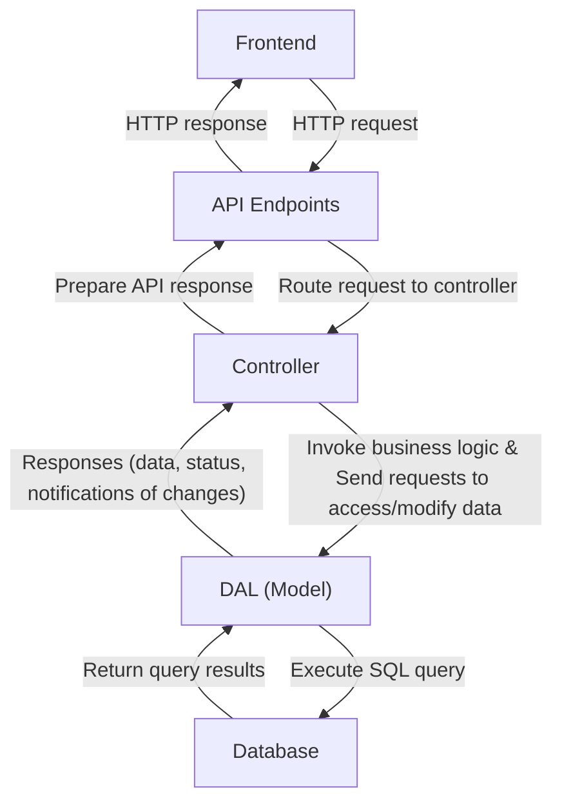

# Controller of MVC

We continue to work on the backend to improve modularity and testability of different components.

## Using a Data Access Object (DAO)

We create an DAO - the `User` class to be used in the DAL `db_crud.py`. This ensures consistent formatting across return values. More specifically, this changes the return values from the `sqlite3.Row` object with user data to a `User` object for read operations, e.g., in `get_user_by_email`, `get_user_by_id`, `get_all_users`. We haven't incorporated it in other operations yet as it's uncessary for now.

## Separating Controllers From Routes

We refactor `auth.py` and `users.py` to separate `auth.py` into `auth_controller.py` + `auth.py`; and separate `users.py` into `user_controller.py` + `users.py`. 

Now routes only expose the API endpoints, get the data from the request and format responses as `jsonify(response), status` to ensure consistency. Our backend hence returns JSON and the status code, which can be directly handled by the JavaScript frontend via `fetch()` (more in Week 9).

The controllers `auth_controller.py` and `user_controller.py` reflect changes on the DAL. The controllers are designed with return values in the same format `{"status": "<success/failure>", "message": “xxx"}, status_code`
We implement server-side validation for email and password format during registration in `auth_controller.py`. If the email and password meet formatting requirements, the user request is forwarded to the corresponding route.

``` python
import re

def is_email_valid(email):
    return bool(re.match(r'^[a-zA-Z0-9._%+-]+@[a-zA-Z0-9.-]+\.[a-zA-Z]{2,}$', email))
```

In the code above, `re` is the Python regex module, and here we want to match the email with the format `r'^[a-zA-Z0-9._%+-]+@[a-zA-Z0-9.-]+\.[a-zA-Z]{2,}$'`. 
- this regex requires the email to be in the format of `x@y.z` where
- `x` is a combination of letters (lower case or upper case), digits and some symbols (`._%+-`)
- `y` is a combination of letters (lower case or upper case), digits and some symbols (`.-`)
- `z` is a string of 2 or more letters (lower or upper case)

`sqlite3` query responses are sometimes hard to interpret or may not provide what the user needs. Hence your controller needs to return meaningful messages that can be understood by the developers and users. For example, when querying a user by email with `get_user_by_email`, if the queried user doesn't exist, `fetchone()` will return `None` instead of raising an error. In this case, your controller should interpret this as "Queried user does not exist."

### Request Flow
The request flow between the different (MVC) components hence become



### Testing
Separating controllers from routes allows controllers to be tested separately without starting the API server and initiating HTTP requests, which enables developers to perform unit testing efficiently. As an example, in the test case `test_admin_add_and_get_user()`, we add a new user with `add_new_user()` defined in the user controller, and test that the user has been successfully added to database with `view_user()`.

The script `backend/tests/test_auth_api.py` contains tests for API endpoints. For simplicity, we will use the `unittest` module to manage API endpoint tests. *Other alternatives such as Postman and cURL are not required in ISD.* You need to import the `requests` module to enable sending HTTP requests, and use the following syntax to send the request and obtain the response. 
``` python
    response = requests.post(f"{BASE_AUTH_URL}/register", json=TEST_USER, headers=HEADERS)
```

To analyze the response, you can use `response.status_code` to get the status code,  `response.text` to get the response message, and `response.json()` to parse response in the JSN format, following syntax
``` python
    data = response.json()
    print(data["user_id"])
```

## Security Enhancement

We add the following to the `create_app()` function in `app.py` to limit the maximum number of fields in POST requests to `MAX_FIELDS` to prevent abuse/denial-of-service (DOS) attacks
```python
MAX_FIELDS = 5
@app.before_request
def limit_request_fields():
    if request.method == "POST":
        data = request.json
        if data and len(data) > MAX_FIELDS:
            return jsonify({
                "status": "error",
                "message": f"Too many fields in request. Maximum allowed is {MAX_FIELDS}."
            }), 400
```

## API Testing (Managed with `unittest`)

API testing using modules `unittest` and `requests` for HTTP requests in `test_auth_api.py`.
<!-- considering using a custom script with unittest to document all tests and link to user stories (document_tests) -->

``` python
import unittest
import requests

BASE_AUTH_URL = "http://127.0.0.1:8080/auth"
HEADERS = {"Content-Type": "application/json"}

TEST_USER = {
    "email": "authuser@example.com",
    "password": "XXXXXXXX",
    "name": "Auth User"
}

...

def test_1_register_user(self):
    """Test POST /auth/register"""
    print("="*30)
    print("1 POST /auth/register")
    print("="*30)
    response = requests.post(f"{BASE_AUTH_URL}/register", json=TEST_USER, headers=HEADERS)
    print(response.status_code, response.text, "\n")
    self.assertIn(response.status_code, [200, 201], "User registration failed")
```

In the above code,
- `request.post` sends an HTTP POST request to the specified URL `{BASE_AUTH_URL}/register`, sendings the details of the `TEST_USER` and specifying headers `{"Content-Type": "application/json"}` so that the data is sent as a JSON object. 
- The response is then returned from the API endpoint with the status code and response text.
- We use `assertIn` to check the value of the `status_code`, and if it is not 200 or 201, the test has failed.

> API endpoint testing in Postman/cURL

- Postman organizes tests by collections, each collection contains requests, 
- Data should be sent in the body as raw JSON, not as URL parameters.
- cURL is a command-line tool available on all major operating systems which also supports sending HTTP requests. The setup is much simpler for cURL and it can be used for API endpoint testing alongside development. The example command 
``` bash
curl -X POST http://127.0.0.1:8080/welcome -H "Content-Type: application/json" -d '{"name":"alice"}'
``` 
sends the payload `{"name":"alice"}` to the API endpoint `http://127.0.0.1:8080/welcome` using an HTTP POST method.
