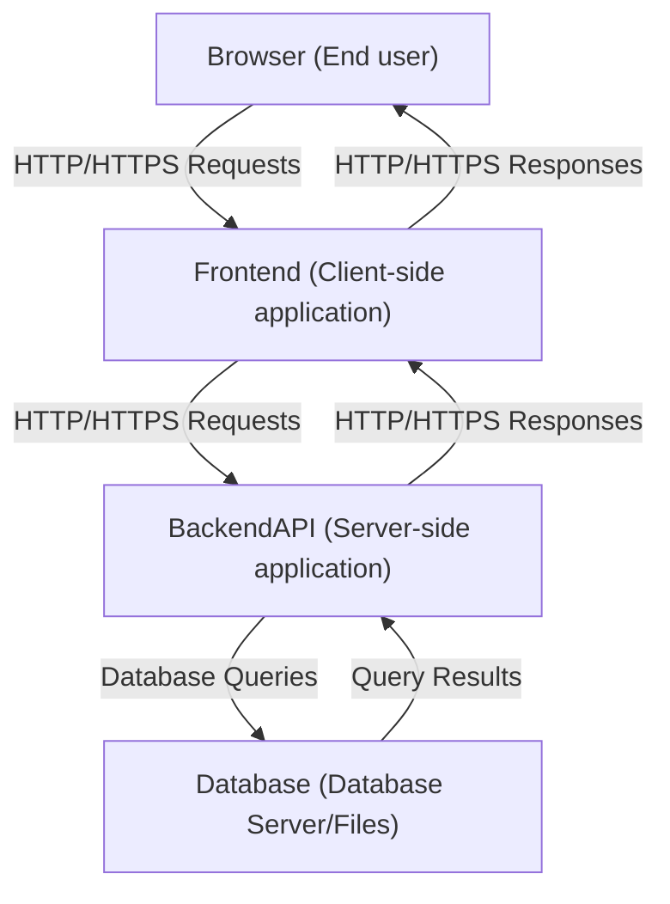

# Web Basics

## The Client-Server Architecture

### Illustration


### IP Addresses & Domain Names

An IP (Internet Protocol) address is a unique numeric label assigned to every device connected to a network that uses the Internet Protocol for communication.
- IPv4 addresses are the most common, with the format `xxx.xxx.xxx.xxx` and each `xxx` has a value between 0-255
- IPv6 addresses are longer and newer (to solve IPv4 exhaustion)

A domain name is a human-readable address used to identify a website on the Internet.

A Domain Name System (DNS) converts domain names to IP addresses.

### Ports and URLs

A full URL structure is: 
``` ruby
<protocol (http or https)>://<domain or ip address>:<port>/<path>
```

On `localhost` (for our full-stack development), 
- Protocol is `http`.
- Domain/IP address is (typically) `localhost` or `127.0.0.1`.
- Port specifies which port to connect to. Some frameworks use default ports if none is specified (e.g., 3000 for React Dev Server, 5000 for Flask).
- Path specifies the location of a specific resource or page on the server.

### Explanation

> A Full-Stack Application
- Client (Frontend)
    * Runs in the browser or client application.
    * Responsible for rendering the user interface, capturing user input, sending requests to the server, and displaying responses from the server.
    * Doesn't contain business logic or access the database directly.
- Server (Backend)
    * Handles application logic.
    * Responsible for defining API endpoints (routes), validating user input, enforcing authentication and authorization, implementing business rules, and coordinating data access, etc. 
- Database
    * The database stores and manages the application's persistent data.
    * Examples include SQLite, PostgreSQL, MySQL.
    * Responsible for storing application data, enforcing data integrity and constraints, executing queries sent by the server, etc.
- Caveat
    * Client and server describe roles, not physical machines/technology stacks.
    * Frontend and backend describe architectural components, and are often tied to implementation and deployment choices.
    * Even if client code is hosted on a server, it doesn't execute there. The client code renders in the user's web browser.
    * Example correct statement: "When I access the Google website, Google’s servers deliver the frontend resources (HTML, CSS, and JavaScript). These resources are then executed and rendered locally in my browser, where the user interface is displayed and user interactions occur."
- `localhost`
    * `localhost` refers to your own computer acting as the server.
    * Typically resolves to IP address `127.0.0.1`.
    * Network requests sent to `localhost` never leave your machine.
    * Typically used for development and testing.
    * For local development, specify a port number in the URL, e.g., `http://127.0.0.1:<port-number>`, following standard port conventions.
    * `localhost` != `127.0.0.1` (are considered different origins) in Flask Cross-Origin Resource Sharing (CORS) (more in Week 9)
- Static & Dynamic Content in Browser Rendering
    * Static content doesn't change per user or request, e.g., HTML content served as-is from the frontend.
    * Dynamic content changes depending on user, data, or context, e.g., HTML generated by the backend, API responses.

> Client-Server Communication

- The client communicates with the server using the HTTP or HTTPS protocol (an application-layer web protocol). 
- When a user performs an action, such as submitting a form or clicking a button, the client sends an HTTP request to the server. 
- This request usually includes the request method (e.g. GET or POST), the target URL, and any required data.
- The server receives the request, processes it and generatess an appropriate HTTP response. 
- The response may contain data, status codes indicating success or failure, and headers. 
- The server sends this response back to the client, which then updates the user interface accordingly.

> Server-Database Communication
- The server interacts with the database to create, retrieve, update, or delete (CRUD) data. 
- This communication typically occurs through database queries, such as SQL statements.
- The database executes the query and returns the result set or confirmation of the operation. 
- The server then processes this data and incorporates it into its response to the client.
- The communication protocol is in general a database protocol, not HTTP.

> API
- Short for Application Programming Interface.
- Refers to the Interface Between Client and Server in web development.
- Typically refers to RESTful (Representational State Transfer, an architectural style) APIs using HTTP methods (GET, POST, PUT, DELETE).
- Provides a contract (between the client and the server) for:
    * What data can be requested or modified
    * How requests should be structured
    * What responses will be returned
- APIs decouple the frontend from the backend, improving maintainability and scalability.

## HTTP Requests & Responses

Each HTTP method maps to a specific operation, such as creating, reading, updating, or deleting a resource, and an HTTP method must be included with every request to a REST API.

> Common HTTP methods

HTTP methods are part of the HTTP specification, which defines their intended semantics, but they are not always strictly enforced by servers or clients. Common usage in RESTful APIs are:

- GET for retrieving data on a server.
- POST for creating new resources.
- PUT for replacing an existing resource with an updated version.
- PATCH for updating an existing resource.
- DELETE for removing data from a database.

> HTTP Headers

HTTP headers let the client and the server pass additional information with a message in a request or response.

Example HTTP Request headers

| <header> | <value> | Description |
| ----------- | ----------- | ----------- |
| Host | `http://127.0.0.1:8080` | Specifies the hostname and port number of the target server handling the request. |
| Content-Type | `application/json` | Indicates that the request payload is formatted as json. Most commonly used. |
| Authorization | `Bearer <token>` | Provides a bearer token [^1] used by the server to authenticate the client. `Bearer` is part of the header value string. |

Example HTTP Response headers [^2]
| <header> | <value> | Description |
| ----------- | ----------- | ----------- |
| Content-Type | `text/html`, `application/json` | `text/html` for a string return or `application/json` for a json. |
| Cotnent-Length | 512 | Specifies the size of the response body. |
| Server | SimpleHTTP/0.6 Python/3.12.1 | Identifies the web server software (Python's built-in http.server). |
| Date | Thu, 22 Jan 2026 01:15:30 GMT | Indicates the date and time at which the response was generated (in GMT). |

More details on [HTTP Headers](https://developer.mozilla.org/en-US/docs/Web/HTTP/Reference/Headers).

> Response Status Code

HTTP response status codes indicate whether a specific HTTP request has been successfully completed.

Common status codes

| Status Code | Description | Example Error Message |
| ----------- | ----------- | ----------- |
| 200 OK | The request succeeded. | "Allocation retrieved successfully." |
| 201 Created | The request succeeded, and a new resource was created as a result. | "New allocation created." |
| 400 Bad Request | The server cannot or will not process the request due to something perceived to be a client error. | "Missing 'project' field." |
| 500 Internal Server Error | The server has encountered a situation it does not know how to handle. | "Unexpected Database Error." |
| 409 Conflict | This response is sent when a request conflicts with the current state of the server. | "Project 'Community Website Redesign' already exists." |
| 404 Not Found | The server cannot find the requested resource (the URL is not recognized). | "No allocation found for 'Community Website Redesign'." |

More details on [MDN HTTP Response Status Code](https://developer.mozilla.org/en-US/docs/Web/HTTP/Reference/Status)

> Examples

An HTTP request (with cURL) may look like 
``` bash
cURL -X POST http://127.0.0.1:8080/welcome \
     -H "Content-Type: application/json" \
     -d '{"name":"TU1"}'
```

An HTTP response (in a Python tuple) may look like 
``` json
({"status":"success", "message": f'Hello, TU1!'}, 200)
```

## Web Servers

Web servers, or more specifically, web server software, are programs that listen for HTTP requests and serve web pages or application content. They are not to be confused with the "server" of the "client-server architecture". Some of the popular web servers are as follow.

| Web Server | Description |
| ----------- | ----------- |
| Apache HTTP Server | Popular open-source web server, can serve static files and proxy requests to app servers. |
| Nginx | High-performance web server and reverse proxy; often used to serve static files or forward requests to application servers. |
| Python's `http.server` | Built-in Python module for simple local testing; serves static files by default. |
| Node.js with Express | Node.js runtime + Express framework can act as a web server for dynamic content. |
| Gunicorn / uWSGI | Application servers for Python apps, often paired with Nginx to serve dynamic content. |

<!-- footnotes -->
[^1]: In HTTP authentication, Bearer refers to a type of authorization token used in the Authorization request header. The client that bears (possesses) the token is trusted.

[^2]: In Flask, these essential headers are automatically set.